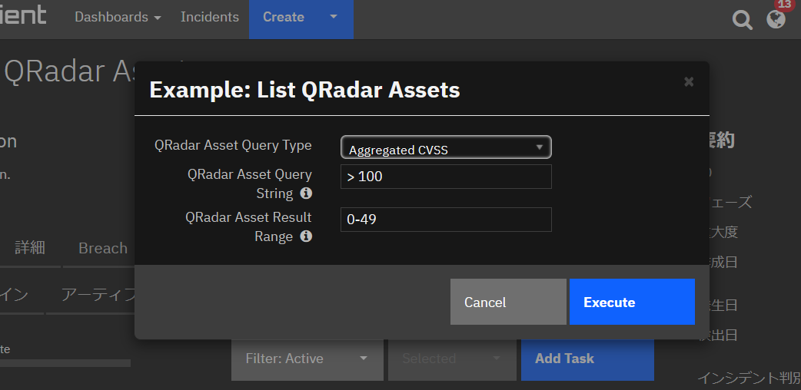
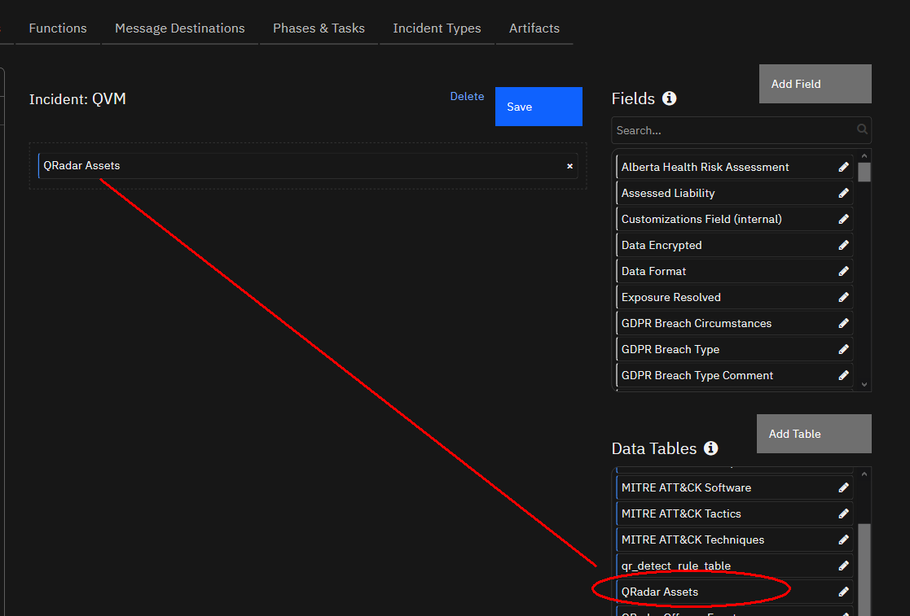

# fn-qradar-asset-search Functions for IBM Resilient

- [Release Notes](#release-notes)
- [Overview](#overview)
- [Requirements](#requirements)
- [Installation](#installation)
- [Uninstall](#uninstall)
- [Troubleshooting](#troubleshooting)
- [Known Limitations](#known-limitations)

---

## Release Notes
### v1.0.0
* Initial Release

---

## Overview
**Resilient Circuits Components for 'fn_qradar_asset_search'**

 

Resilient Circuits Components for 'fn_qradar_asset_search' provides QRadar Assets search capability which will help SOC analyst to get more endpoint information gathered by QRadar Asset Profiler and external Vulnerability Assessment results imported to QRadar Assets table.

Queries are possible for IP Addresses, Aggregated CVSS, and Vulnerability count.

For more information, please see the [User Guide](./doc/README.md).

---

## Requirements
* Resilient platform >= `v38.1.71`
* An Integration Server running `resilient_circuits>=30.0.0`
  * To set up an Integration Server see: [ibm.biz/res-int-server-guide](https://ibm.biz/res-int-server-guide)
* QRadar SIEM
  * The integration only invokes assets API endpoint, not qvm endpoint. So QVM license should not be the requirement
  * QRadar user-id and password OR authorization token must be provided to make the integration work with QRadar API
  * May work with proxy but not tested (resilient_lib RequestsCommon is used)
---

## Installation
* Download the `fn_qradar_asset_search.zip`.
  (or create a package from source, or use `pip install -e` instead of the following pip install step)

* Copy the `.zip` to your Integration Server and SSH into it.

* **Unzip** the package:
  ```
  $ unzip fn_qradar_asset_search-x.x.x.zip
  ```
  
* **Change Directory** into the unzipped directory:
  ```
  $ cd fn_qradar_asset_search-x.x.x
  ```
  
* **Install** the package:
  ```
  $ pip install fn_qradar_asset_search-x.x.x.tar.gz
  ```
  
* Import the **configurations** into your app.config file:
  ```
  $ resilient-circuits config -u -l fn-qradar-asset-search
  ```
  
* Import the fn_qradar_asset_search **customizations** into the Resilient platform:
  ```
  $ resilient-circuits customize -y -l fn-qradar-asset-search
  ```
  
* Open the config file, scroll to the bottom and edit your `fn_qradar_asset_search` configurations:
  ```
  $ vi ~/.resilient/app.config
  ```
  | Config | Required | Example | Description |
  | ------ | :------: | ------- | ----------- |
  | **host** | Yes | `hostname` | *QRadar hostname or IP address. Scheme is not required (`https://` will be added)* |
  | **username<br /> password** | Selectively Yes | `username`<br />`password` | *Either username + password **OR** authtoken is needed* |
  | **authtoken** | Selectively Yes | da570c70-83d4-4e0b-8efe-b29ceefa3f89 | *Either username + password **OR** authtoken is needed*<br />*username/password must be **blank** to use authtoken* |
  | **verify_cert** | No | `/path/to/certfile`<br />`true`<br />`false` | Default is `true` but test is only done with `false` setting during the development |

  You'll also need to check your `integrations` configuration (`https_proxy=`) if you need proxy to reach the QRadar instance.

* **Save** and **Close** the app.config file.

* [Optional]: Run selftest to test the Integration you configured:

  ```
  $ resilient-circuits selftest -l fn-qradar-asset-search
  ```

  * This `selftest` checks the connectivity to your configured QRadar instance.

* **Run** resilient-circuits or restart the Service on Windows/Linux:
  
  ```
  $ resilient-circuits run
  ```

### Custom Layouts
- You'll need to add a data table **QRadar Assets** (`qradar_assets`) to any of your existing tab or newly created tab:




---

## Uninstall
* SSH into your Integration Server.
* **Uninstall** the package:
  ```
  $ pip uninstall fn-qradar-asset-search
  ```
* Open the config file, scroll to the [fn_qradar_asset_search] section and remove the section or prefix `#` to comment out the section.
* **Save** and **Close** the app.config file.

---

## Troubleshooting
There are several ways to verify the successful operation of a function.

### Resilient Action Status
* When viewing an incident, use the Actions menu to view **Action Status**.
* By default, pending and errors are displayed.
* Modify the filter for actions to also show Completed actions.
* Clicking on an action displays additional information on the progress made or what error occurred.

### Resilient-Circuits
* The log is controlled in the `.resilient/app.config` file under the section [resilient] and the property `logdir`.
* The default file name is `app.log`.
* Each function will create progress information.
* Failures will show up as errors and may contain python trace statements.

---

## Known Limitations

- The integration code is not tested on Python 2.7 environment so less likely to work on the Integration Server which only has Python 2.7. The code is tested on Windows with Python 3.6+
- As the author's environment does not have a private repository configured, App Host deployment could not be tested.