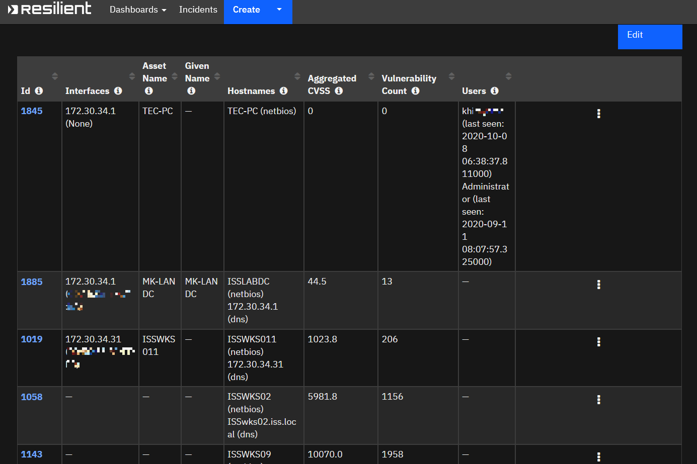

# **User Guide:** fn_qradar_asset_search_v1.0.0

## Table of Contents
- [Key Features](#key-features)
- [Function - QRadar Asset Search](#function---qradar-asset-search)
- [Data Table - QRadar Assets](#data-table---qradar-assets)
- [Rules](#rules)
- [Known Limitations](#known-limitations)

---

## Key Features
* Search **QRadar Assets** from the incident **Action** menu by:
  * IP Addresses (comma separated list, or a single value)
  * Aggregated CVSS (such as  `> 100` )
  * Vulnerability count (such as  `> 10` )
* Returned values are stored in a table
* Search invocation from `︙` menu is possible for the IP Address type of the **Artifact**

---

## Function - QRadar Asset Search
Search QRadar Asset by IP address, by aggregated CVSS score, or by vulnerability count

 

<details><summary>Inputs:</summary>
<p>

| Name | Type | Note |
| ---- | :--: | ------- |
| `artifact_id` | `number` | Set the correct value gotten from the Resilient. Only needed when you invoke the function from the Artifact `︙` menu |
| `incident_id` * | `number` | Set the correct value gotten from the Resilient |
| `qvm_query_type` * | `text` | Either `ip_addr`, `cvss_sum`, or `vuln_count` |
| `qvm_query_value` * | `text` | One or more (,) ip addresses for `ip_addr` type<br />`>10` etc for `cvss_sum` or `vuln_count` type |
| `qvm_result_range` | `text` | `0-9`, etc. Default is `0-49` |

</p>
</details>

<details><summary>Outputs:</summary>
<p>

```python
results = {
	'state': 'Success',
    'code': 200,
    'content': [
        {'id': 1845, 'asset_url': 'https://x.x.x.x/console/do/assetprofile/AssetDetails?dispatch=viewAssetDetails&assetId=1845&listName=vulnList', 'aggregated_cvss': 0.0, 'vulnerability_count': 0, 'interfaces': '172.30.34.1 (None)', 'hostnames': 'TEC-PC (netbios)', 'asset_name': 'TEC-PC', 'users':'kh (last seen: 2020-10-11 01:50:43.512000)\nAdministrator (last seen: 2020-09-11 08:07:57.325000)'},
        {'id': 1885, 'asset_url': 'https://x.x.x.x/console/do/assetprofile/AssetDetails?dispatch=viewAssetDetails&assetId=1885&listName=vulnList', 'aggregated_cvss': 44.5, 'vulnerability_count': 13, 'interfaces': '172.30.34.1 (xx:xx:xx:xx:xx:xx)', 'hostnames': 'ISSLABDC (netbios)\n172.30.34.1(dns)', 'given_name': 'MK-LAN DC', 'asset_name': 'MK-LAN DC'}],
    'content_range': '0-1/2'
}
```

</p>

When failed:

<p>


```python
results = {
	'state': 'Failed',
    'code': 999, 	# Status code from the QRadar Assets REST API endpoint
    'reason': 'xxx'	# Failed reason
}
```

</p>

</details>


<details><summary>Workflows</summary>

  <details><summary>Example Pre-Process Script:</summary>
  <p>

  ```python
 
query_type_dict = { 'IP Address': 'ip_addr', 'Aggregated CVSS': 'cvss_sum', 'Vulnerability Count': 'vuln_count' }

inputs.incident_id = incident.id
inputs.qvm_query_type = query_type_dict.get(rule.properties.qvm_query_type)
inputs.qvm_query_value = rule.properties.qvm_query_string
inputs.qvm_result_range = rule.properties.qvm_result_range

  ```

  </p>
  </details>

  <details><summary>Example Post-Process Script:</summary>
  <p>

  ```python
  
output_data = results['content']
if output_data:
  for asset in output_data:
    qradar_asset = incident.addRow("qradar_assets")
    hyperlinked_id = '<b><a href="{1}">{0}</a></b>'.format(asset.get('id'), asset.get('asset_url'))
    qradar_asset.id = helper.createRichText(hyperlinked_id)
    qradar_asset.interfaces = asset.get('interfaces')
    qradar_asset.asset_name = asset.get('asset_name')
    qradar_asset.given_name = asset.get('given_name')
    qradar_asset.hostnames = asset.get('hostnames')
    qradar_asset.cvss_sum = str(asset.get('aggregated_cvss')) if asset.get('aggregated_cvss') else '0'
    qradar_asset.vuln_count = int(asset.get('vulnerability_count')) if asset.get('vulnerability_count') else 0
    qradar_asset.users = asset.get('users')

  ```

  </p>
  </details>

</details>

---

## Data Table - QRadar Assets

 

#### API Name:
qradar_assets

#### Columns:
| Column Name | API Access Name | Type | Tooltip |
| ----------- | --------------- | ---- | ------- |
| Asset Name | `asset_name` | `text` | Name of the asset |
| Aggregated CVSS | `cvss_sum` | `text` | The sum of the CVSS scores of the vulnerabilities on this asset |
| Given Name | `given_name` | `text` | Given Name of the asset |
| Hostnames | `hostnames` | `textarea` | Hostnames of the asset |
| Id | `id` | `textarea` | ID of the asset |
| Interfaces | `interfaces` | `textarea` | IP Address and MAC of the asset |
| Users | `users` | `textarea` | Usernames  seen on this asset |
| Vulnerability Count | `vuln_count` | `number` | The total number of vulnerabilities associated with this asset |

---

## Rules
| Rule Name | Object | Workflow Triggered |
| --------- | ------ | ------------------ |
| Example: Search QRadar Assets | artifact | `example_search_qradar_asset` |
| Example: List QRadar Assets | incident | `example_list_qradar_assets` |

---

## Known Limitations

- The integration code is not tested on Python 2.7 environment so less likely to work on the Integration Server which only has Python 2.7. The code is tested on Windows with Python 3.6+
- As the author's environment does not have a private repository configured, App Host deployment could not be tested.