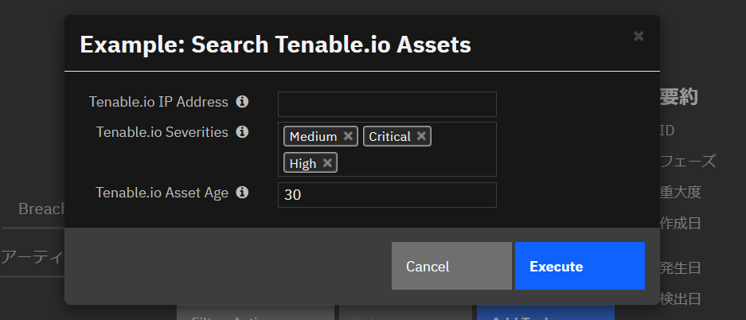
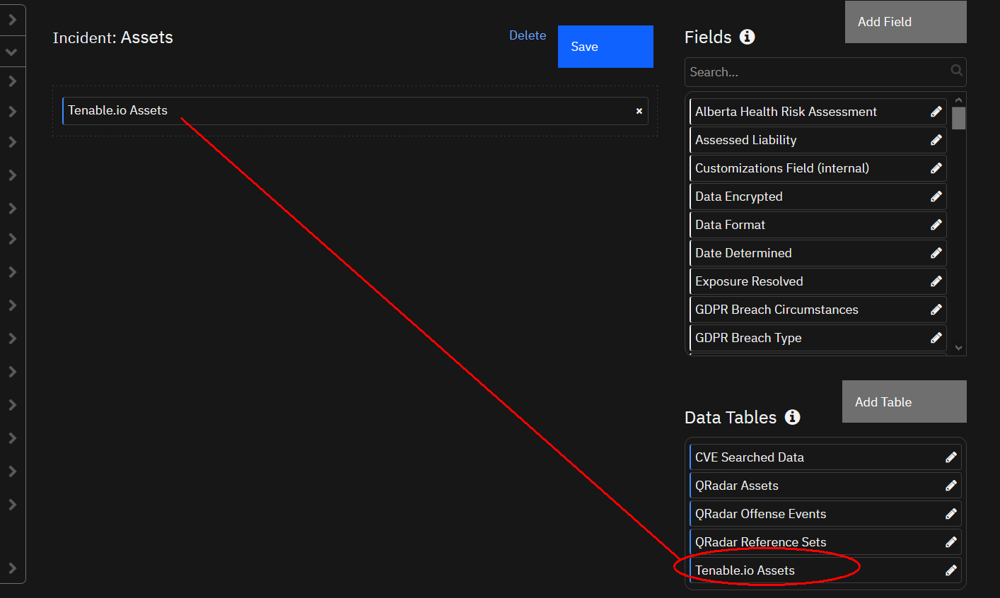

# fn-tenable-io-assets Functions for IBM Resilient

- [Release Notes](#release-notes)
- [Overview](#overview)
- [Requirements](#requirements)
- [Installation](#installation)
- [Uninstall](#uninstall)
- [Troubleshooting](#troubleshooting)
- [Known Limitations](#known-limitations)

---

## Release Notes
### v1.0.0
* Initial Release

---

## Overview
**Resilient Circuits Components for 'fn_tenable_io_assets'**

 

Resilient Circuits Components for 'fn_tenable_io_assets'

You can search Tenable.io assets by IP address from Resilient incident/artifact

You can also launch a pre-defined Tenable.io scan from Resilient incident/artifact

For more information, please see the [User Guide](./doc/README.md).

---

## Requirements
* Resilient platform >= `v38.1.71`
* An Integration Server running `resilient_circuits>=30.0.0`
  
* To set up an Integration Server see: [ibm.biz/res-int-server-guide](https://ibm.biz/res-int-server-guide)
  
* Tenable.io
  * The integration invokes Tenable.io REST API via pyTenable library

  * Used functions are:

    * workbenches.vuln_assets
    * scans.launch
    * scans.status

    Give appropriate privileges to the Tenable.io account of which access_key and secret_key are used for the integration

---

## Installation
* Download the `fn_tenable_io_assets-x.x.x.tar.gz`.
  (or create a package from source, or use `pip install -e` instead of the following pip install step)

* Copy the `.tar.gz` to your Integration Server and SSH into it.

* **Install** the package:
  
  ```
  $ pip install fn_tenable_io_assets-x.x.x.tar.gz
  ```
  
* Import the **configurations** into your app.config file:
  ```
  $ resilient-circuits config -u -l fn-tenable-io-assets
  ```
  
* Import the fn_tenable_io_assets **customizations** into the Resilient platform:
  ```
  $ resilient-circuits customize -y -l fn-tenable-io-assets
  ```
  
* Open the config file, scroll to the bottom and edit your fn_tenable_io_assets configurations:
  ```
  $ nano ~/.resilient/app.config
  ```
  | Config | Required | Example | Description |
  | ------ | :------: | ------- | ----------- |
  | **host_name** | Yes | `cloud.tenable.com` | *Set `cloud.tenable.com` for most of the cases* |
  | **access_key** | Yes | `2c935f5.....e7265db` | *The API keys that Tenable.io generates for each system user* |
  | **secret_key** | Yes | `0553ac5.....d017cf9` | *The API keys that Tenable.io generates for each system user* |
  | **default_scan_name** | Yes | `MK-LAN` | *Default scan name used for scanning when no value is given. Mandatory when you invoke a scan from Artifact `︙` menu* |
  | **tio_ui_type** | Yes | `new` | *Either `classic` or `new`* |

  You'll also need to check your `integrations` configuration (`https_proxy=`) if you need proxy to reach the QRadar instance.
  
* **Save** and **Close** the app.config file.

* [Optional]: Run selftest to test the Integration you configured:
  
  ```
  $ resilient-circuits selftest -l fn-tenable-io-assets
  ```
  
* **Run** resilient-circuits or restart the Service on Windows/Linux:
  
  ```
  $ resilient-circuits run
  ```

### Custom Layouts
* You'll need to add the data table **Tenable.io Assets** (`tenable_io_assets`) to any of your existing tab or newly created tab:

 

---

## Uninstall
* SSH into your Integration Server.
* **Uninstall** the package:
  ```
  $ pip uninstall fn-tenable-io-assets
  ```
* Open the config file, scroll to the [fn_tenable_io_assets] section and remove the section or prefix `#` to comment out the section.
* **Save** and **Close** the app.config file.

---

## Troubleshooting
There are several ways to verify the successful operation of a function.

### Resilient Action Status
* When viewing an incident, use the Actions menu to view **Action Status**.
* By default, pending and errors are displayed.
* Modify the filter for actions to also show Completed actions.
* Clicking on an action displays additional information on the progress made or what error occurred.

### Resilient-Circuits
* The log is controlled in the `.resilient/app.config` file under the section [resilient] and the property `logdir`.
* The default file name is `app.log`.
* Each function will create progress information.
* Failures will show up as errors and may contain python trace statements.

---

## Known Limitations

- The integration code is not tested on Python 2.7 environment so less likely to work on the Integration Server which only has Python 2.7. The code is tested on Windows with Python 3.6+
- As the author's environment does not have a private repository configured, App Host deployment could not be tested.
- Tenable.io environment used for the development is `trial` subscription. Behavior may not be the same as the production version of Tenable.io.