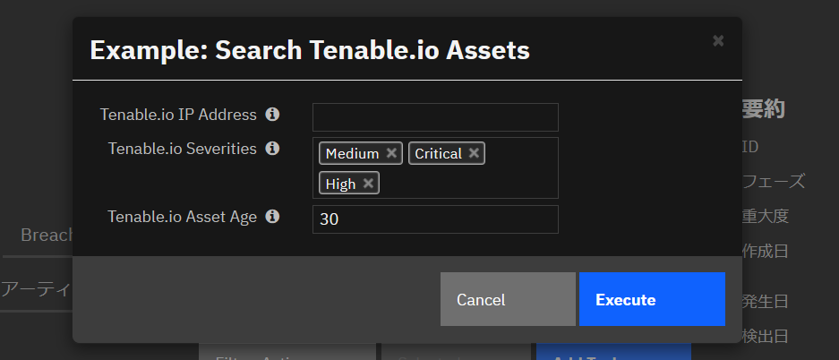

# **User Guide:** fn_tenable_io_assets_v1.0.0

## Table of Contents
- [Key Features](#key-features)
- [Function - Tenable.io Assets](#function---tenableio-assets)
- [Data Table - Tenable.io Assets](#data-table---tenableio-assets)
- [Rules](#rules)
- [Known Limitations](#known-limitations)

---

## Key Features
* Search **Tenable.io Assets** from the incident **Action** menu by:

  * IP Addresses (comma separated list, or a single value)
  * Severities (comma separated list of `Info`, `Low`, `Medium`, `High`, `Critical` combination)

  Returned values are stored in the [Data Table - Tenable.io Assets](#data-table---tenableio-assets)

* Launch pre-defined **Tenable.io scan** from the incident **Action** menu:

  * with IP address(es) to override the default scan targets
  * or leave the IP address blank to invoke the scan for default targets

* Search assets / Launch scan are also possible from **Artifact** `︙` menu if Artifact type is IP Address

  * Default scan name defined in the `app.config` will be used for Tenable.io scanning

---

## Function - Tenable.io Assets
Function for multiple operations:
- Get Asset data from Tenable.io.
- Invoke Tenable.io Vulnerability scan for the Asset(s).

 
 

<details><summary>Inputs:</summary>
<p>

| Name | Type | Note |
| ---- | :--: | ------- |
| `incident_id` | `number` | Set the correct value gotten from the Resilient |
| `artifact_id` | `number` | Set the correct value gotten from the Resilient. Only needed when you invoke the function from the Artifact `︙` menu |
| `tio_operation_type` | `text` | Tenable.io Operation such as `search` and `scan`. |
| `tio_ip_addr` | `text` | An IP address or comma separated addresses |
| `tio_severity` | `text` | Comma separated list of `Info`, `Low`, `Medium`, `High`, `Critical` combination |
| `tio_asset_age` | `number` | Asset age in days to retrieve |
| `tio_scan_name` | `text` | Scan name to override the default scan name in `app.config` |

</p>
</details>

<details><summary>Outputs:</summary>
<p>

```python
results = {
	'state': 'Success',
    'content': [
        {
            'id': '172bda62-dcc5-43c2-a581-84e862cbbae4',
            'asset_url': 'https://cloud.tenable.com/tio/app.html#/vulnerability-management/dashboards/default/assets/asset-details/172bda62-dcc5-43c2-a581-84e862cbbae4/overview',
            'last_seen': '2020-09-06T06:28:40.148Z',
        	'agent_name': '[]',
	        'interfaces': '172.30.34.1',
    	    'hostnames': 'ISSLABDC (netbios)',
        	'severities': 'Critical: 2\nHigh: 0\nMedium: 10\nLow: 2\nInfo: 0'
        }
    ],
    'size': 1
}
```

</p>
</details>

<details><summary>Workflows</summary>

  <details><summary>Example Pre-Process Script (Search):</summary>
  <p>

  ```python
  
inputs.incident_id = incident.id
inputs.tio_operation_type = 'search'
inputs.tio_ip_addr = rule.properties.tio_ip_addr
if rule.properties.tio_severity:
  inputs.tio_severity = ','.join(rule.properties.tio_severity)
inputs.tio_asset_age = rule.properties.tio_asset_age

  ```

  </p>
  </details>

  <details><summary>Example Post-Process Script (Search):</summary>
  <p>

  ```python

output_data = results['content']
if output_data:
  for asset in output_data:
    tio_asset = incident.addRow("tenable_io_assets")
    hyperlinked_id = '<b><a href="{1}">{0}</a></b>'.format(asset.get('id'), asset.get('asset_url'))
    tio_asset.tio_id = helper.createRichText(hyperlinked_id)
    tio_asset.interfaces = asset.get('interfaces')
    tio_asset.hostnames = asset.get('hostnames')
    tio_asset.severities = asset.get('severities')
    tio_asset.last_seen = asset.get('last_seen')
    tio_asset.agent_name = asset.get('agent_name')

  ```

  </p>
  </details>

  <details><summary>Example Pre-Process Script (Scan):</summary>
  <p>

  ```python
  
inputs.incident_id = incident.id
inputs.tio_operation_type = 'scan'
inputs.tio_ip_addr = rule.properties.tio_ip_addr
inputs.tio_scan_name = rule.properties.tio_scan_name

  ```

  </p>
  </details>

  <details><summary>Example Post-Process Script (Scan):</summary>
  <p>

  ```python
  
scan_name = results.get('scan_name')
scan_uuid = results.get('scan_uuid')
scan_url = results.get('scan_url')
if scan_uuid:
  hyperlinked_text = 'Tenable.io scan initiated. Scan name: {0}, Scan uuid: <b><a href="{2}">{1}</a></b>'.format(scan_name, scan_uuid, scan_url)
  incident.addNote(helper.createRichText(hyperlinked_text))

  ```

  </p>
  </details>

</details>

---

## Data Table - Tenable.io Assets

 

#### API Name:
tenable_io_assets

#### Columns:
| Column Name | API Access Name | Type | Tooltip |
| ----------- | --------------- | ---- | ------- |
| Id | `tio_id` | `textarea` | Tenable.io asset uuid |
| Interfaces | `interfaces` | `textarea` | IP address(es) of the asset |
| Hostnames | `hostnames` | `textarea` | Hostnames of the asset |
| Severities | `severities` | `textarea` | Tenable.io vulnerability count per severity |
| Last seen | `last_seen` | `text` | Date and time when the asset is last seen |
| Agent name | `agent_name` | `text` | Tenable.io agent name |

---


## Rules
| Rule Name | Object | Workflow Triggered |
| --------- | ------ | ------------------ |
| Example: Search Tenable.io Assets | incident | `example_search_tenable_io_assets` |
| Example: Search Tenable.io Assets by IP | artifact | `example_search_tenable_io_assets_by_ip` |
| Example: Launch Tenable.io Scan | incident | `example_launch_tenable_io_scan` |
| Example: Launch Tenable.io Scan by IP | artifact | `example_launch_tenable_io_scan_by_ip` |

---

## Known Limitations

- The integration code is not tested on Python 2.7 environment so less likely to work on the Integration Server which only has Python 2.7. The code is tested on Windows with Python 3.6+
- As the author's environment does not have a private repository configured, App Host deployment could not be tested.
- Tenable.io environment used for the development is `trial` subscription. Behavior may not be the same as the production version of Tenable.io.